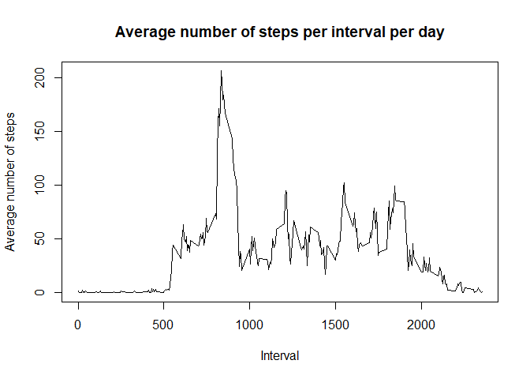
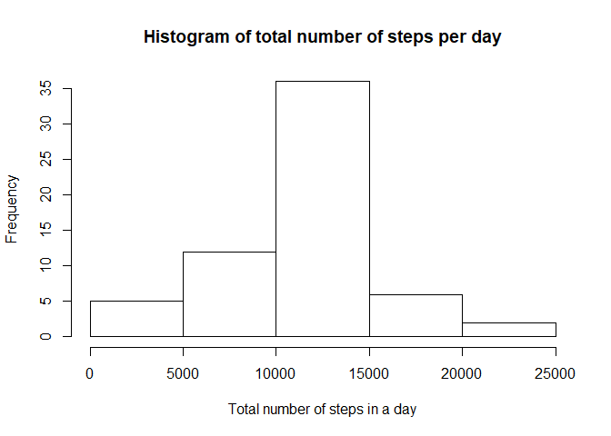
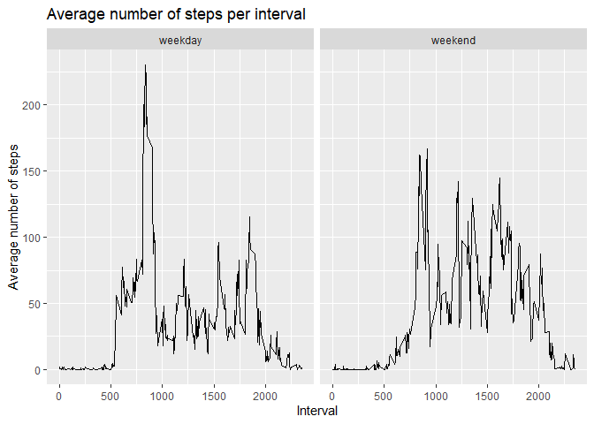

### Load all packages used in this exploratory analysis

```r
library(knitr)
library(dplyr)
```

```
## 
## Attaching package: 'dplyr'
```

```
## The following objects are masked from 'package:stats':
## 
##     filter, lag
```

```
## The following objects are masked from 'package:base':
## 
##     intersect, setdiff, setequal, union
```

```r
library(ggplot2)
```

### Set up working directory

```r
setwd("/Users/Wes/Documents/Coursera/RepData_PeerAssessment1")
```

### Loading and preprocessing the data

```r
data_row <- read.csv('activity.csv')
head(data_row, 10)
```

```
##    steps       date interval
## 1     NA 2012-10-01        0
## 2     NA 2012-10-01        5
## 3     NA 2012-10-01       10
## 4     NA 2012-10-01       15
## 5     NA 2012-10-01       20
## 6     NA 2012-10-01       25
## 7     NA 2012-10-01       30
## 8     NA 2012-10-01       35
## 9     NA 2012-10-01       40
## 10    NA 2012-10-01       45
```

### What is mean total number of steps taken per day?

```r
data <- data_row[!is.na(data_row$steps), ]
by_day <- group_by(data, date)
steps_by_day <- summarise(by_day, total = sum(steps, na.rm=TRUE))
```

```
## `summarise()` ungrouping output (override with `.groups` argument)
```

```r
steps_by_day
```

```
## # A tibble: 53 x 2
##    date       total
##    <fct>      <int>
##  1 2012-10-02   126
##  2 2012-10-03 11352
##  3 2012-10-04 12116
##  4 2012-10-05 13294
##  5 2012-10-06 15420
##  6 2012-10-07 11015
##  7 2012-10-09 12811
##  8 2012-10-10  9900
##  9 2012-10-11 10304
## 10 2012-10-12 17382
## # ... with 43 more rows
```

```r
hist(steps_by_day$total, main="Histogram of total number of steps per day", 
     xlab="Total number of steps in a day")
```

<!-- -->

```r
summary(steps_by_day)
```

```
##          date        total      
##  2012-10-02: 1   Min.   :   41  
##  2012-10-03: 1   1st Qu.: 8841  
##  2012-10-04: 1   Median :10765  
##  2012-10-05: 1   Mean   :10766  
##  2012-10-06: 1   3rd Qu.:13294  
##  2012-10-07: 1   Max.   :21194  
##  (Other)   :47
```

```r
mean_value <- as.integer(mean(steps_by_day$total))
median_value <- median(steps_by_day$total)
mean_value
```

```
## [1] 10766
```

```r
median_value
```

```
## [1] 10765
```
**The mean value is 10766 and the median value is 10765.**

### What is the average daily activity pattern?

```r
by_interval <- group_by(data, interval)
steps_by_interval <- summarise(by_interval, mean = mean(steps, na.rm=TRUE))
```

```
## `summarise()` ungrouping output (override with `.groups` argument)
```

```r
steps_by_interval
```

```
## # A tibble: 288 x 2
##    interval   mean
##       <int>  <dbl>
##  1        0 1.72  
##  2        5 0.340 
##  3       10 0.132 
##  4       15 0.151 
##  5       20 0.0755
##  6       25 2.09  
##  7       30 0.528 
##  8       35 0.868 
##  9       40 0     
## 10       45 1.47  
## # ... with 278 more rows
```

```r
plot(x = steps_by_interval$interval, y = steps_by_interval$mean, type = 'l',
     main="Average number of steps per interval per day",
     xlab="Interval",
     ylab="Average number of steps")
```

<!-- -->

```r
interval_value <- steps_by_interval[which(steps_by_interval$mean == max(steps_by_interval$mean)), ]$interval
interval_value
```

```
## [1] 835
```
**The 5-minute interval that contains the maximum number of steps is 835.**


## Imputing missing values

```r
sum(is.na(data_row))
```

```
## [1] 2304
```
**The total number of missing rows is 2304.**  

The strategy I used is to fill in the missing values with the mean for that 5 minute interval

```r
data2 <- data_row
for (i in 1:(nrow(data2))){
    if (is.na(data2$steps[i])){
        interval <- data2$interval[i]
        interval_mean <- steps_by_interval[steps_by_interval$interval == interval, 'mean']
        data2$steps[i] <- interval_mean
    }
}

data2$steps <- as.integer(data2$steps)
by_day2 <- group_by(data2, date)
steps_by_day2 <- summarise(by_day2, total = sum(steps))
```

```
## `summarise()` ungrouping output (override with `.groups` argument)
```

```r
steps_by_day2
```

```
## # A tibble: 61 x 2
##    date       total
##    <fct>      <int>
##  1 2012-10-01 10641
##  2 2012-10-02   126
##  3 2012-10-03 11352
##  4 2012-10-04 12116
##  5 2012-10-05 13294
##  6 2012-10-06 15420
##  7 2012-10-07 11015
##  8 2012-10-08 10641
##  9 2012-10-09 12811
## 10 2012-10-10  9900
## # ... with 51 more rows
```

```r
hist(steps_by_day2$total, main="Histogram of total number of steps per day", 
     xlab="Total number of steps in a day")
```

<!-- -->

```r
summary(steps_by_day2)
```

```
##          date        total      
##  2012-10-01: 1   Min.   :   41  
##  2012-10-02: 1   1st Qu.: 9819  
##  2012-10-03: 1   Median :10641  
##  2012-10-04: 1   Mean   :10750  
##  2012-10-05: 1   3rd Qu.:12811  
##  2012-10-06: 1   Max.   :21194  
##  (Other)   :55
```

```r
mean_value2 <- as.integer(mean(steps_by_day2$total))
median_value2 <- median(steps_by_day2$total)
mean_value2 
```

```
## [1] 10749
```

```r
median_value2
```

```
## [1] 10641
```
**The mean value is 10749 and the median value is 10641.**

```r
mean_value
```

```
## [1] 10766
```

```r
median_value
```

```
## [1] 10765
```
**As can be seen, both the mean and median values have decreased slightly.**

## Are there differences in activity patterns between weekdays and weekends?

```r
data2$date <- as.Date(data2$date)
data2$day <- weekdays(data2$date)
data2$day[data2$day %in% c('Saturday', 'Sunday')] <- 'weekend'
data2$day[data2$day %in% c('Monday', 'Tuesday', 'Wednesday', 'Thursday', 'Friday')]<- 'weekday'
data2$day <- as.factor(data2$day)

by_type_of_day <- group_by(data2, interval, day)
steps_by_type_of_day <- summarise(by_type_of_day, mean = mean(steps, na.rm=TRUE))
```

```
## `summarise()` regrouping output by 'interval' (override with `.groups` argument)
```

```r
steps_by_type_of_day
```

```
## # A tibble: 576 x 3
## # Groups:   interval [288]
##    interval day       mean
##       <int> <fct>    <dbl>
##  1        0 weekday 2.16  
##  2        0 weekend 0.125 
##  3        5 weekday 0.4   
##  4        5 weekend 0     
##  5       10 weekday 0.156 
##  6       10 weekend 0     
##  7       15 weekday 0.178 
##  8       15 weekend 0     
##  9       20 weekday 0.0889
## 10       20 weekend 0     
## # ... with 566 more rows
```

```r
ggplot(steps_by_type_of_day) + geom_line(aes(x=interval, y=mean)) + facet_wrap(~day) + 
    ggtitle('Average number of steps per interval') +
    xlab('Interval') +
    ylab('Average number of steps')
```

<!-- -->
